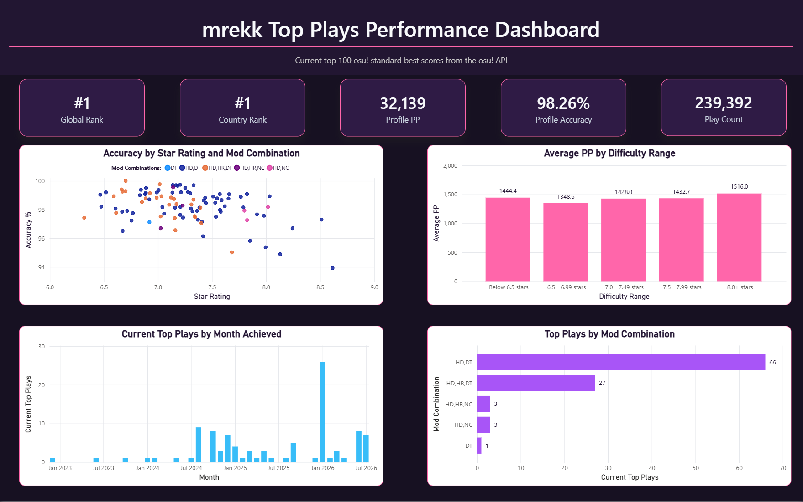

# osu! Player Performance Analytics

An end-to-end data analytics portfolio project that collects, processes, validates, stores, analyzes, and visualizes osu! player performance data using Python, pandas, PostgreSQL, SQL, and Power BI.

The current version analyzes the osu! standard player `mrekk` using public data from the osu! API v2.

## Project Goal

The goal of this project is to build a repeatable analytics pipeline that:

1. Extracts player profile and best-score data from the osu! API.
2. Saves raw API responses as timestamped JSON files.
3. Cleans and transforms nested API data with Python and pandas.
4. Validates processed datasets before database loading.
5. Loads validated data into PostgreSQL.
6. Analyzes player performance using SQL.
7. Prepares dashboard-ready SQL views for Power BI.
8. Builds an interactive Power BI dashboard.

## Analysis Questions

This project is focused on answering questions such as:

- How does accuracy relate to pp in a player's top scores?
- How does beatmap star rating relate to pp?
- Do higher-star plays still produce more pp when accuracy is lower?
- Which mod combinations appear most often in the player's top scores?
- Which mod combinations are associated with higher average pp or accuracy?
- When were the player's current top scores achieved?
- What difficulty ranges appear most represented in the player's best scores?

Note: Date-based score analysis currently reflects when the player's current top 100 best scores were achieved, not the player's complete historical score timeline.

## Technology Stack

Currently implemented:

- Python
- pandas
- requests
- python-dotenv
- osu! API v2
- PostgreSQL
- SQL
- SQLAlchemy
- psycopg
- Power BI Desktop
- DAX measures
- Git and GitHub

Planned or in progress:

- Power Query refinements
- Final dashboard polish
- Additional dashboard screenshots or exports

## Project Structure

```text
data/
├── raw/
└── processed/

src/
├── config.py
├── extract.py
├── transform.py
├── validate.py
└── load.py

sql/
├── schema.sql
├── analysis_queries.sql
└── views.sql

dashboard/
├── osu_performance_dashboard.pbix
└── screenshots/
    ├── dashboard_overview.png
    └── osu_performance_dashboard_overview.pdf

README.md
requirements.txt
.env.example
.gitignore
```



[View dashboard PDF](dashboard/screenshots/dashboard_overview.pdf)